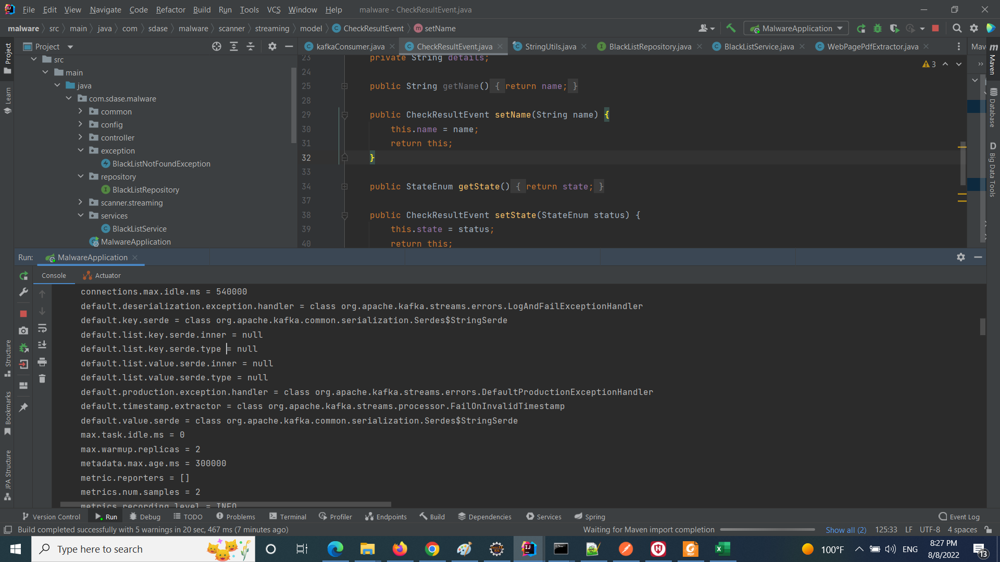

# Building Microservices java application  with Spring Boot.
### Created by : Alireza Gholamzadeh Lahroodi
#### Email Address : AlirezaGholamzadehLahrudi@gmail.com
#### Linkedin Profile : https://www.linkedin.com/in/alireza-gholamzadeh-lahroodi/

This application is a single microservice that is responsible for reading and providing the data of Apache kafka topics.

### View documentation
Use the following path to view the documentation produced by open-api and
swagger use the following path, after the execution
#### http://localhost:8080/documentation.html

  

#### The Server will run on http://localhost:8080 address
